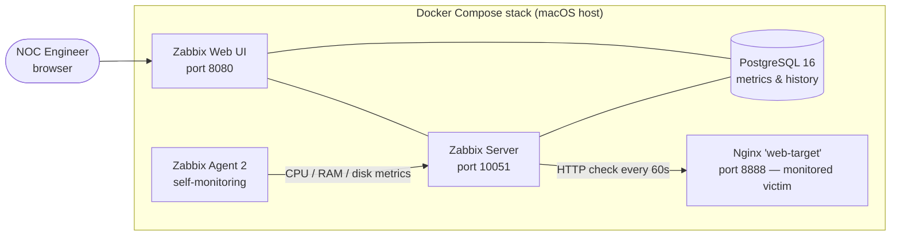

# Lab 01 — 24x7 Monitoring Lab (Zabbix)

**Goal:** Deploy a production-style monitoring stack, monitor multiple targets, configure alert triggers, then **simulate an outage and capture the full detect → alert → acknowledge → resolve cycle** — the daily workflow of an L1 NOC engineer.

**Stack:** Zabbix 7.0 LTS · Docker Compose · PostgreSQL 16 · Nginx (monitored target) · Zabbix Agent 2

---

## Architecture



| Component | Role in a real NOC |
|---|---|
| **Zabbix Server** | The brain — polls targets, evaluates triggers, generates alerts |
| **PostgreSQL** | Stores all metric history and event data |
| **Zabbix Web** | The dashboard a NOC engineer watches on shift |
| **Zabbix Agent 2** | Installed on monitored hosts; reports OS-level metrics |
| **Nginx (web-target)** | Stand-in for a production web application; deliberately taken down to trigger an incident |

## 1. Deployment

The entire stack is defined in [`docker-compose.yml`](./docker-compose.yml) and deployed with a single command:

```bash
docker compose up -d
docker compose ps   # verify all 5 containers are Up
```

> 📸 **Screenshot 01** — `screenshots/01-containers-running.png`
> Output of `docker compose ps` showing all five containers healthy.

> 📸 **Screenshot 02** — `screenshots/02-zabbix-dashboard.png`
> Zabbix web UI after first login (Monitoring → Dashboard).

## 2. Monitoring configuration

Two monitored targets were configured:

**Target A — the Zabbix server host itself** (via Zabbix Agent 2)
Template applied: `Linux by Zabbix agent` → collects CPU load, memory utilization, disk space, and process counts automatically.

**Target B — the Nginx web application** (agentless)
A *Simple check* / web scenario polls `http://web-target:80` every 60 seconds and validates an HTTP 200 response. This mirrors how a NOC monitors customer-facing services it cannot install agents on.

**Trigger configured:**

| Trigger | Condition | Severity |
|---|---|---|
| `Web application is DOWN` | HTTP check fails for 2 consecutive polls | High |
| `High CPU utilization` | CPU load > 80% for 5 min | Warning |
| `Low disk space` | Free space < 20% | Warning |

> 📸 **Screenshot 03** — `screenshots/03-hosts-configured.png`
> Data collection → Hosts, showing both targets with green availability icons.

## 3. Incident simulation — the core of this lab

To validate the monitoring pipeline end-to-end, I deliberately caused an outage:

```bash
docker stop web-target        # simulate the web application crashing
```

**Observed timeline (mirrors a real L1 shift):**

| Time | Event | L1 action |
|---|---|---|
| T+0 | Container stopped | — |
| T+~2 min | Trigger fires: `Web application is DOWN` (High) | Alert appears in Monitoring → Problems |
| T+3 min | — | **Acknowledged** the alert with a triage note |
| T+5 min | Root cause identified: service process down | Restored service: `docker start web-target` |
| T+~6 min | Trigger auto-resolves, problem closes | Resolution documented |

> 📸 **Screenshot 04** — `screenshots/04-problem-fired.png`
> Monitoring → Problems showing the High-severity alert in red.

> 📸 **Screenshot 05** — `screenshots/05-acknowledged.png`
> The alert acknowledged with triage note: *"Investigating — HTTP check failing, suspect service down. — GN"*

> 📸 **Screenshot 06** — `screenshots/06-resolved.png`
> Problem view showing the incident resolved (green) with full event timeline.

## 4. What this demonstrates

- **Monitoring tools:** deployed and configured Zabbix from scratch, including templates, items, triggers, and severities
- **Alert management:** tuned trigger conditions to avoid false positives (2 consecutive failures, not 1)
- **Incident response:** followed detect → acknowledge → triage → resolve → document, the standard L1 loop
- **Infrastructure as code:** the whole stack is reproducible from one `docker-compose.yml`

## Lessons learned

- A single failed poll is noise; alerting on **consecutive failures** is what separates actionable alerts from alert fatigue.
- The acknowledge step matters: in a 24x7 team it tells the next shift *someone owns this incident*.
- Monitoring the monitor: the Zabbix server itself is a host that must be watched.

## Next step

The alert generated here feeds **[Lab 02 — Incident Management Workflow](../02-incident-workflow/)**, where the same outage becomes a Jira ticket handled per ITIL with SLA-based escalation.
